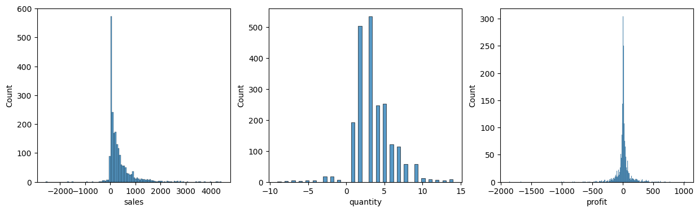
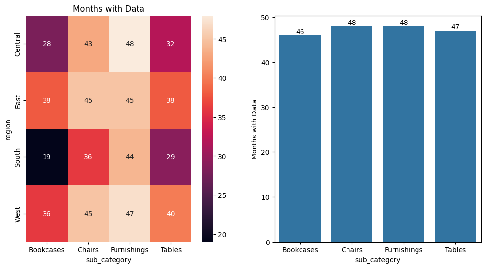
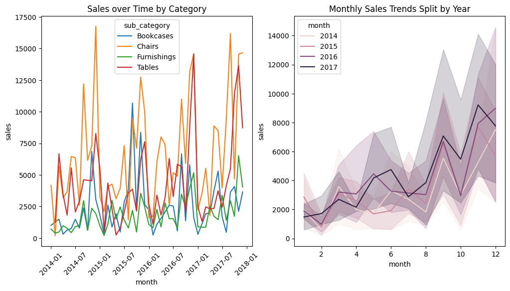
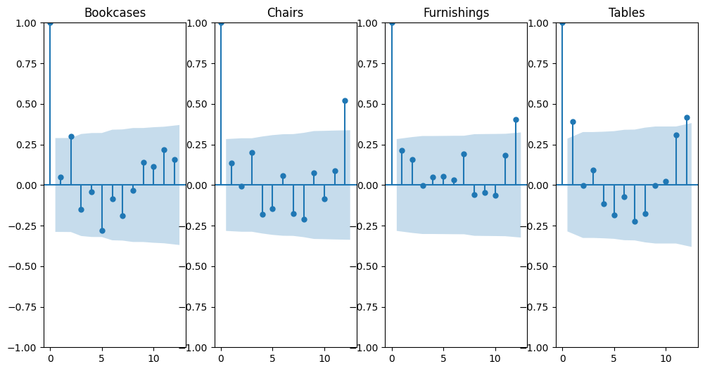
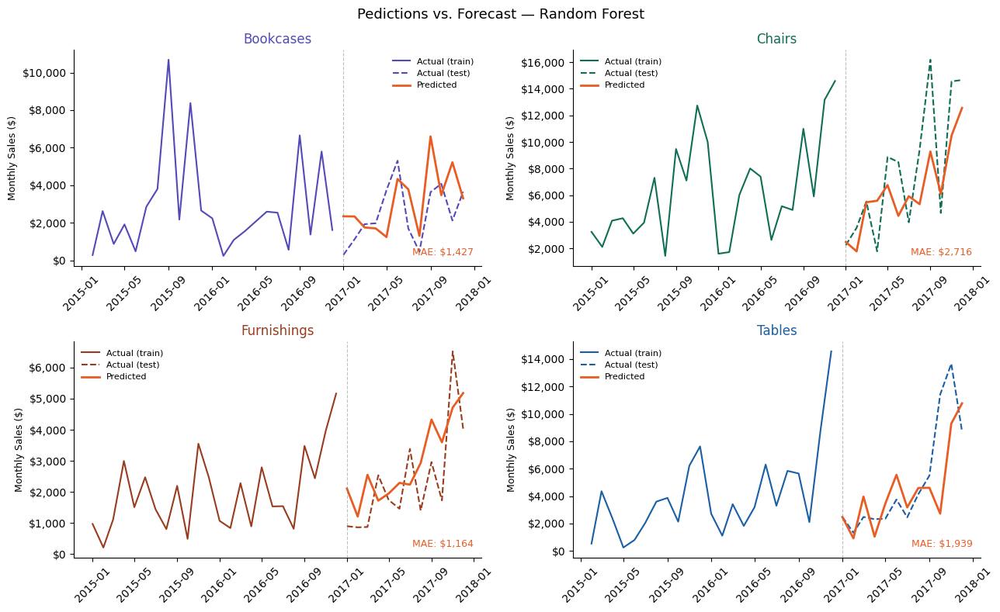
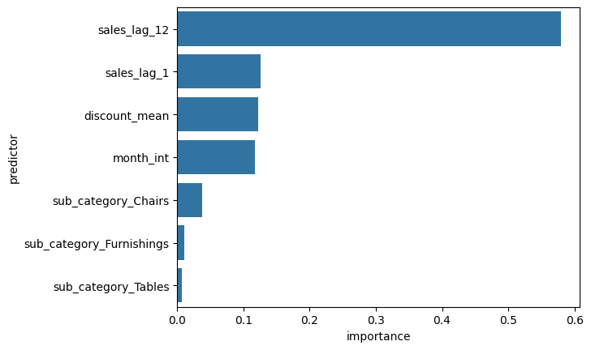

# Évaluation technique - Scientifique des données
#### Sara Hall
##### 31 Mars, 2026

Code used to generate thee responses is in a notebook located [here](notebooks/test-technique-notebook.ipynb). If this was a full project rather than a proof of concept for a test, I would convert the main bits of code into a py file and only use the notebook for demo purposes, but in the interest of time I'm leaving it as is. I would also put more effort into making the visuals look nice if I were presenting to a client.

# Partie 1 - Préparation des données

## Q1.1 — 3 principaux enjeux de données

**1. Les retours sont encodés comme des valeurs négatives**

Les retours sont encodés comme des quantités négatives (ainsi que des ventes et des profits négatifs), le discount étant identique pour la vente et le retour.  J'ai donc regroupé par `customer_id`, `product_id` et `order_id`, puis sommé les quantités, les ventes et les profits, pris la moyenne du discount et retenu la date minimale. Ensuite, j'ai supprimé les lignes où `quantity = 0`, car ce sont celles où la vente et le retour se sont complètement annulés. De cette façon, les retours sont correctement pris en compte sans biaiser les données.

**2. Séries temporelles trop creuses par région × sous-catégorie**

Le jeu de données contient seulement 4 régions et 4 sous-catégories pour environ 2 000 transactions. Une prévision par région et par sous-catégorie produirait des groupes avec aussi peu que 19 mois de données, ce qui n'est pas suffisant pour construire des séries temporelles robustes.  Pour cette raison, j'ai décidé d'agréger les ventes au niveau national par sous-catégorie. De cette façon, chaque groupe dispose de presque 48 mois de données, ce qui permet d'obtenir des séries suffisamment denses pour la modélisation.

**3. Fuite de données dans les colonnes agrégées**

Les colonnes `avg_region_sales` et `avg_city_sales` ne sont rien d'autre que les moyennes globales des ventes par région et par ville sur l'ensemble du jeu de données. Si on les inclut dans les données d'entraînement, le modèle aurait accès à de l'information provenant des données de test, ce qui constitue une fuite de données (*data leakage*). Pour cette raison, ces colonnes ont été supprimées du DataFrame.

## Q1.2 — 2 features les plus influentes

**1. La saisonnalité — lag de 12 mois**

Les ventes présentent une saisonnalité annuelle marquée, notamment pour les chaises, les tables et les bibliothèques.   Pour exploiter ce signal, j'ai calculé des features de lag, en particulier un décalage de 1 et 12 mois. Ça permettent au modèle d'utiliser les ventes du même mois de l'année précédente comme prédicteur. Ces lags ont été calculés par sous-catégorie afin d'éviter toute fuite de données entre les groupes.

**2. La sous-catégorie — encodage one-hot**

La sous-catégorie a un impact direct sur le niveau des ventes, chaque type de meuble ayant ses propres dynamiques de demande. C'est également une variable utile pour les gestionnaires de magasins, qui peuvent s'en servir pour anticiper les commandes par type de produit. Pour que le modèle puisse l'utiliser, la variable catégorielle a été transformée via un encodage one-hot (*one-hot encoding*).

## Q1.3 — Actions pour améliorer la qualité des données

**1. Associer les données aux emplacements des magasins**

Les données actuelles semblent refléter les adresses de livraison plutôt que les emplacements des magasins. Chaque magasin dessert une démographie distincte qui pourrait améliorer la précision des prévisions, notamment au niveau du magasin ou du marché local. Il serait utile d'associer chaque transaction à un identifiant de magasin pour capturer ces dynamiques.

**2. Collecter davantage de données historiques**

Avec seulement 4 ans de données, le signal de saisonnalité est limité. Des séries historiques plus longues permettraient au modèle de mieux distinguer les tendances structurelles des variations ponctuelles, et d'améliorer la fiabilité des prévisions.

**3. Introduire un niveau de granularité intermédiaire pour les produits**

Les données contiennent deux niveaux de granularité : le produit individuel et la sous-catégorie. Pour les besoins de la gestion des stocks, il serait utile d'introduire un niveau intermédiaire. Par exemple, distinguer les bibliothèques à 5 tablettes de celles à 10 tablettes. Cela permettrait des prévisions plus précises sans aller jusqu'au niveau du SKU individuel.

**4. Enregistrer l'historique des promotions**

Connaître les dates et l'ampleur des promotions passées permettrait de modéliser leur impact sur les ventes et d'améliorer la précision des prévisions lors de futures campagnes.

**5. Assurer l'unicité des `product_id`**

Actuellement, 8 produits distincts partagent le même `product_id`, ce qui complique le suivi des stocks et introduit une ambiguïté dans les données. S'assurer que chaque produit correspond à un identifiant unique améliorerait la fiabilité du catalogue produit et la traçabilité des ventes.

# Partie 2 : Présentation des résultats au client

## Q2.1 - Les résultats de ma solution ML

| | Baseline naïve (lag 12) | Random Forest | Amélioration |
|---|---|---|---|
| MAE | $1,942 | $1,811 | **-$131/mois** |
| RMSE | $2,753 | $2,479 | **-$274** |
| MAPE | 67.5% | 68.1% | — |

**Interprétation pour le client**

Le modèle Random Forest prédit les ventes mensuelles par sous-catégorie avec une erreur moyenne de 1811$ par mois. Pour mettre ce chiffre en contexte, les ventes mensuelles moyennes varient entre 1852$ (Furnishings) et 6660$ (Chairs). Une erreur de 1811$ représente donc environ 27% des ventes moyennes de Chairs, ce qui est raisonnable pour un premier modèle sur 4 ans de données.
Plus important, le modèle surpasse la baseline naïve (simplement utiliser les ventes de l'année précédente) sur les métriques MAE et RMSE. Cela démontre que le modèle capte des signaux réels au-delà de la simple saisonnalité, valeur ajoutée pour l'entreprise. 

De plus, le modèle nous permet d'identifier les features les plus importantes pour prédire les ventes futures. Par exemple, on constate que les ventes de l'année précédente constituent le signal le plus déterminant, ce qui confirme la présence d'une forte saisonnalité annuelle. On remarque également que le rabais moyen mensuel a un impact significatif — ce qui est particulièrement utile pour les gestionnaires de magasins, puisqu'il s'agit d'un levier qu'ils peuvent contrôler directement. 

Ce modèle est un point de départ. Avec davantage de données historiques et l'ajout des informations promotionnelles recommandées, les performances s'amélioreraient significativement. La valeur immédiate est de démontrer la faisabilité de l'approche et d'établir une baseline solide pour les itérations futures.

## Q2.2 - Comments les gestionnaires vont l'utiliser:

**Concrètement, ce modèle permet aux gestionnaires de magasins de :**

1. Anticiper la demande par sous-catégorie un mois à l'avance, permettant une meilleure gestion des stocks
2. Réduire les ruptures de stock sur les sous-catégories à forte valeur comme Chairs et Tables
3. Quantifier l'impact des rabais sur les ventes futures — le modèle confirme que le rabais moyen est un prédicteur significatif

# Partie 3- Détails de ma solution ML

## Q3.1 - Décris l'approche

J'ai entraîné un modèle Random Forest sur des séries temporelles mensuelles agrégées par sous-catégorie (Bookcases, Chairs, Furnishings, Tables) au niveau national. Le modèle prédit les ventes totales du mois suivant par sous-catégorie.

| Feature | Rôle |
|---|---|
| `sales_lag_1`, `sales_lag_12` | Momentum et saisonnalitê annuelle |
| `month_int` | Saisonnalité mensuelle |
| `discount_mean` | Levier contrôlable par le gestionnaire |
| `sub_category` (one-hot) | Identifiant du groupe à prédire |

Le choix d'un modèle global entraîné sur toutes les sous-catégories simultanément était motivé par la taille limitée du jeu de données. Entraîner un modèle séparé par sous-catégorie n'aurait laissé que ~36 observations par modèle après le découpage train/test. Le Random Forest permet au modèle d'apprendre des patterns communs à toutes les sous-catégories tout en utilisant l'encodage one-hot pour différencier les groupes.

La division train/test est strictement temporelle — 2014–2016 pour l'entraînement, 2017 pour le test — afin de simuler fidèlement les conditions réelles de déploiement où le futur est toujours inconnu.

Je suis convaincu parce-que: 
1. Le modèle surpasse la baseline naïve (lag 12) sur MAE et RMSE
2. Les features les plus importantes (sales_lag_12, sales_lag_1) sont cohérentes avec ce qu'on attendrait intuitivement, les ventes passées prédisent les ventes futures
3. Aucune fuite de données, toutes les features sont disponibles au moment de la prédiction
4. L'approche est validée sur une année complète de données non vues (2017)

## Q3.2 - Les avantage et les inconvénient

**Avantage**

1.**Robuste aux outliers**: le Random Forest est peu sensible aux valeurs aberrantes, ce qui est important dans un jeu de données avec des transactions très variables

2.**Pas d'hypothèse de linéarité**: contrairement à la régression linéaire, il capture les interactions non-linéaires entre features sans configuration supplémentaire

3.**Facile à mettre à jour**: chaque mois, on ajoute les nouvelles données, on recalcule les lags, et on réentraîne

4.**Interprétable via feature importance**: on peut expliquer au client quels signaux le modèle utilise

**Inconvénients**

1.**Extrapolation limitée**: le Random Forest ne peut pas prédire des valeurs au-delà de la plage observée en entraînement. Si les ventes explosent au-delà des maximums historiques, le modèle sous-estimera

2.**Pas de modélisation explicite de la tendance**: un modèle dédié comme Prophet modéliserait explicitement la tendance long terme et la saisonnalité, ce qui pourrait être plus robuste avec plus de données

3.**Données limitées**: avec seulement 4 ans d'historique et une seule catégorie de produits, le modèle manque de signal pour généraliser pleinement

4.**Nécessite un réentraînement régulier**: sans pipeline de réentraînement automatisé, les performances se dégraderont avec le temps à mesure que les patterns évoluent

# Partie 4 - Problèmes suite à la mise en production

## Q4.1 Expliques les prédiction <désastreuses>

Les métriques globales peuvent masquer des erreurs localisées. Si le modèle surestime une sous-catégorie et sous-estime une autre, les erreurs se compensent et le MAE global reste stable. Le problème est donc invisible au monitoring agrégé.
Les causes les plus probables sont :

1. **Data drift**: les patterns d'achat ont changé et le modèle n'a pas été réentraîné
2. **Problème de données**: un pipeline brisé ou un changement de format corrompt les features en entrée
3. **Événement exceptionnel**: promotion, nouveau concurrent, ou choc saisonnier que le modèle n'a jamais vu

## Q4.1 Investigation
1. Segmenter les métriques par sous-catégorie pour localiser exactement où les prédictions échouent.
2. Vérifier les données en entrée en priorité — valeurs nulles, distributions anormales, changements de format.
3. Comparer la distribution des features récentes avec celles d'entraînement pour détecter un data drift.
4. Analyser les résidus récents — sont-ils systématiquement positifs ou négatifs? Cela indiquerait un biais directionnel nouveau.


# Partie 5: L'assistant intelligent

## Q5.1 - Un Design 

L'assistant permet aux gestionnaires de magasins d'explorer des scénarios de ventes en langage naturel. Le gestionnaire pose une question ou soumet un scénario, et l'assistant appelle le modèle de prévision en arrière-plan pour générer une réponse concrète et actionnable.

L'architecture proposée est un chat où le gestionnaire pose une question, puis :

1. **LLM** — interprète la question et formate la réponse. On peut utiliser une API externe (ex: OpenAI, Anthropic) ou un modèle local avec Ollama pour les clients soucieux de la confidentialité des données.
2. **Le LLM a accès à un outil de prévision (Random Forest)**
    - Reçoit : sous-catégorie, mois, `sales_lag_1`, `sales_lag_12`, discount
    - Retourne : ventes prévues en dollars
3. **Le LLM traduit le résultat en recommandation actionnable** à destination du gestionnaire

Exemple de flux concret:
Le gestionnaire demande: "Si j'augmente mon rabais sur les chaises à 20% en novembre, quelles sont mes ventes prévues?"

1. Le LLM extrait les paramètres — sous-catégorie: Chairs, mois: novembre, discount: 0.20
2. Il appelle le modèle RF avec ces paramètres
3. Le modèle retourne une prévision — ex: $8200
4. Le LLM compare avec le scénario sans rabais — ex: $7100
5. Il répond: "Un rabais de 20% sur les chaises en novembre devrait générer environ 8200$ de ventes, soit 1100$ de plus que sans rabais. Attention : à ce niveau de rabais, la marge sera réduite."

## Q5.2 - Un exemple d'instruction système
```
Tu es un assistant de gestion des ventes pour des gestionnaires de magasins de meubles.
Tu as accès à un modèle de prévision des ventes que tu peux appeler avec les paramètres
suivants : sous-catégorie, mois, discount moyen, et ventes du mois précédent.

Règles:
- Réponds toujours en 3 lignes maximum
- Donne toujours un chiffre de ventes prévu en dollars
- Si le gestionnaire compare deux scénarios, présente la différence en dollars et en pourcentage
- Ne fais jamais de prévision au-delà de 3 mois — le modèle n'est pas fiable sur cet horizon
```